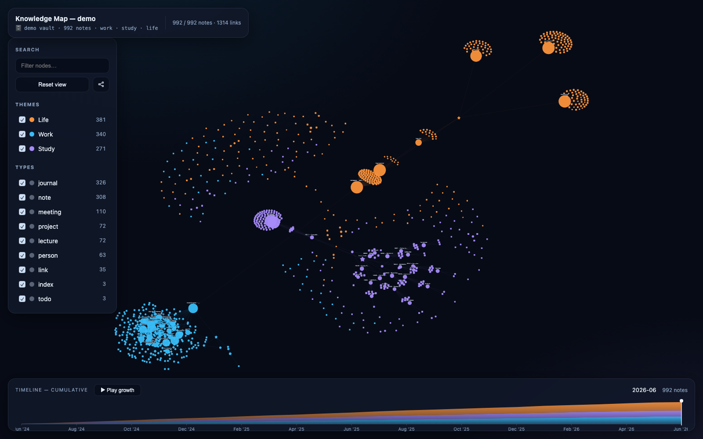

# brain-map — constellation edition

> Turn a folder of Markdown notes (an Obsidian vault or a `gbrain export`) into **one
> self-contained, interactive HTML knowledge map** — a dark graphite constellation coloured
> by the best available freshness signal, with a timeline you can scrub to watch the base grow
> and a click-to-inspect panel that exposes exactly where each date came from.

**This is the maintained fork** — [`aikirias/brain-map-skill`](https://github.com/aikirias/brain-map-skill).
It carries the constellation redesign, the five-band freshness model, the Audit lens and the
honest offline runtime options described below. Originally forked from
[`vladignatyev/brain-map-skill`](https://github.com/vladignatyev/brain-map-skill) by Vladimir
Ignatev, whose builder, timeline and demo corpus are the foundation this is built on — thank
you. Still MIT, still one file out, still no server.

**Works with:** Claude Code · OpenAI Codex · Cursor · Gemini CLI · OpenClaw · or just run the script.



## See it in 5 seconds (no setup)

A prebuilt demo ships in this repo — **no notes to generate, no embeddings, no gbrain,
no Python.** Open the file:

```bash
open demo/brain-map.html        # macOS
xdg-open demo/brain-map.html    # Linux
start demo/brain-map.html       # Windows
```

992 fictional notes across three themes (**work · study · life**). Scrub the timeline,
press **Play growth**, click nodes, toggle filters, flip on **Audit**.

## Build from your own notes

```bash
python3 scripts/build_map.py <notes_dir> out.html --title "My Second Brain"

# Reproducible freshness: band every note against a fixed reporting date
python3 scripts/build_map.py <notes_dir> out.html --as-of 2026-06-15

# Fully offline file: inline a Cytoscape bundle you already have on disk
python3 scripts/build_map.py <notes_dir> out.html --cytoscape-js ./cytoscape.min.js

open out.html
```

`<notes_dir>` = your Obsidian vault, or a `gbrain export --dir <out>` directory. The map
reads plain Markdown: YAML frontmatter (`tags`, `created`, `updated`) + `[[wikilinks]]`.

### Dependencies are optional

| Setup | Result |
|-------|--------|
| **Nothing** (stdlib Python only) | Builds anywhere; the browser computes the layout (Cytoscape `cose`). |
| `pip install -r requirements.txt` (networkx, numpy, scipy) | Layout pre-computed → 1000-node maps open instantly and look cleaner. |

The builder auto-detects networkx and picks the better path. No gbrain, no embeddings,
no server required either way.

## What it reads

- **Theme** = top-level folder — _your_ folders, whatever they are → node & edge colour.
  Colours are assigned automatically from a palette (no fixed taxonomy); `Work/`,
  `Study/`, `Life/` keep their legacy colours if present, root-level notes are `Other`.
- **Type** = subfolder / tags → node shape (person, meeting, journal, lecture, project,
  link, todo, index, note).
- **Edges** = resolved `[[wikilinks]]`, including ordinary note titles and GBrain-style
  relative slugs such as `[[projects/hermes-gbrain]]`. Node size scales with link count;
  hubs get labels.
- **Timeline** = `created` timestamps, bucketed by month, stacked by theme. No `created`
  in the frontmatter? It falls back to the file's own timestamp, so plain vaults still
  get a timeline.
- **Freshness** = the first of `last_updated`, `updated`, `modified` present, then `created`,
  then the file's own timestamp. The inspector always names which one it used. Filesystem
  time is an approximate transport signal and may be reset by a copy, checkout, export or
  sync; it must not be interpreted as semantic GBrain history.

### Freshness: five bands and a continuous score

Age is measured in whole days from the note's update date to the reference date (`--as-of`,
or now). Every note lands in exactly one band:

| Band | Age | Meaning |
|------|-----|---------|
| **fresh** | ≤ 7 days | touched this week |
| **recent** | 8–30 days | touched this month |
| **settled** | 31–90 days | stable, not stale |
| **dormant** | 91–365 days | drifting out of mind |
| **oxidized** | > 365 days | over a year untouched |
| _unknown_ | — | only when no date can be found at all |

Bands are what you **filter and label** with. Rendering uses a separate **continuous
freshness score in [0,1]** (1 = brand new, decaying with a 120-day half-life and
approaching 0 with age), which drives node luminance, saturation and halo — so two
oxidized notes three years apart still look different, and the constellation reads as a
gradient rather than five flat buckets. The inspector shows the exact score.

**Audit** is a lens, not a band: it isolates oxidized **and** orphan (unlinked) notes, and
states the counts for each while it's active. Theme, type and timeline filters keep applying.

### Privacy and offline behavior

The builder only reads local Markdown. It never uploads note contents and **never downloads
anything** — not even the graph library. Generated HTML defaults to the vault's basename
instead of embedding its absolute filesystem path; use `--source-label` when you want a
specific display name.

| Mode | What the HTML does | Header says |
|------|--------------------|-------------|
| default | loads Cytoscape from a pinned CDN URL (`cdnjs`, version-locked) | **Network runtime** |
| `--cytoscape-js PATH` | inlines that local bundle; the file works with no network at all | **Local runtime** |
| `--strict-offline` | succeeds **only** with a plausible official Cytoscape 3 browser bundle supplied via `--cytoscape-js`; otherwise refuses and writes no file | **Local runtime** |

`--strict-offline` fails before the output is created, so a refusal never leaves a
half-honest file behind. Validation is deliberately non-executing and therefore best-effort:
the bundle must have an official-distribution size and Cytoscape Consortium/UMD markers.
The builder rejects stubs, prose, HTML error pages, and unrelated JavaScript, but it does not
execute untrusted input to prove every API. Use an official Cytoscape 3 browser bundle from
your own `node_modules`, a release download, or an existing offline mirror.

The richer your cross-linking (people cards, meeting attendees, index pages), the more
legible the map. Designed to pair with the [save-note](https://github.com/vladignatyev/save-note-skill)
skill, which writes exactly this shape.

## In the HTML

- **Explore surface** — a compact top dock (title, source, live counts, as-of date, runtime
  label), a collapsible controls panel on the left, the inspector on the right, timeline
  along the bottom. Dark graphite; colour means data, never decoration.
- **Scrub / Play** the timeline → the graph reveals notes up to that month; Play animates
  the whole base growing from empty to today.
- **Filter** by theme, type and freshness band, each group collapsible with live
  active/total counts; **search** rings matches (**⌘/Ctrl K** focuses it, **Esc** clears).
- **Audit** isolates oxidized and orphan notes, highlights them, and reports
  `N flagged — X oxidized, Y orphan`.
- **Click** a node → the rest dims, its neighbourhood lights up, and the selected node
  renders at full strength (age never costs you legibility once you've selected it).
- **Inspector** states the freshness band, age in days, the updated timestamp, *which field*
  that came from, the created date, link count, orphan status, file path, summary, tags and
  clickable neighbours.
- **Hierarchy**: hubs (≥7 links) stay labelled, mid-degree notes label up as you zoom in,
  edges stay quiet until you select something.
- Responsive down to a phone; honours `prefers-reduced-motion`.

## Install as an agent skill

**Claude Code**
```bash
git clone https://github.com/aikirias/brain-map-skill ~/.claude/skills/brain-map
```

**OpenAI Codex**
```bash
git clone https://github.com/aikirias/brain-map-skill ~/.agents/skills/brain-map
```

**Cursor / others** — paste `SKILL.md` into your agent's instructions; it's self-contained.

## Regenerate the demo corpus

```bash
python3 scripts/generate_demo_notes.py /tmp/demo-vault   # 992 invented notes
python3 scripts/build_map.py /tmp/demo-vault demo.html
```

All demo people, orgs and events are fictional — no real data.

## Tests

```bash
python3 -m unittest discover -s tests
```

Stdlib `unittest`, no dependencies — covers the freshness bands and score, GBrain slug
resolution, payload shape, `--keep-positions` (parsing, surviving notes, placement of new
notes, malformed and non-finite payloads), runtime inlining and refusal, template safety
contracts, and CLI error handling. Browser tests skip here with an install hint.

**Browser tests** drive a generated map with real Cytoscape — search, filtering, the
inspector, the timeline and Audit mode, through actual clicks, drags and key presses:

```bash
python3 -m venv .venv
.venv/bin/pip install -r requirements-test.txt
.venv/bin/python -m playwright install chromium
.venv/bin/python -m unittest discover -s tests -p "test_browser_ui.py" -v
```

The map under test inlines a local Cytoscape bundle, so the browser needs no network. The
bundle is taken from `$CYTOSCAPE_JS` if set, else `tests/.cache/cytoscape.min.js`, else
downloaded once from the pinned CDN URL and checksum-verified into that cache:

```bash
CYTOSCAPE_JS=/path/to/cytoscape.min.js .venv/bin/python -m unittest discover -s tests -v
```

Playwright is the only optional dependency: without it (or its Chromium) the browser tests
skip and say how to install them; the command above runs them.

## GBrain coverage and roadmap

This release is a **read-only page-topology review**, not a second memory system. It reads
Markdown pages, frontmatter and resolved wikilinks—including GBrain relative slugs—and never
writes back to GBrain.

What v1 does not yet represent:

- hot facts, supersessions, expirations or fact provenance;
- typed backend edges that are not rendered as Markdown wikilinks;
- embedding coverage or retrieval health;
- true page-version/edge history. The timeline is a creation-date growth view, not replay.

Freshness uses the best signal present in each file (`last_updated`, `updated`, `modified`,
then `created`). Filesystem `mtime` is only an explicitly labelled approximation and may be
reset by copying or syncing a vault. A future deterministic GBrain adapter should consume
backend `updated_at`/history and add version-diff review without requiring an LLM or creating
a duplicate graph database. Deeper structural analysis can be exported to Gephi rather than
turning this static viewer into another operational service.

## Layout

```
brain-map-skill/
├── SKILL.md                      # agent skill spec
├── scripts/
│   ├── build_map.py              # the builder (Markdown dir → interactive HTML)
│   └── generate_demo_notes.py    # writes the fictional demo vault
├── tests/
│   ├── test_build_map.py         # stdlib unittest suite
│   └── test_browser_ui.py        # Playwright UI tests (optional dependency)
├── demo/
│   ├── brain-map.html            # PREBUILT — open it, zero setup
│   ├── vault/                    # 992 source Markdown notes
│   └── preview.png
├── requirements.txt              # optional: networkx, numpy, scipy
├── requirements-test.txt         # optional: playwright (browser tests only)
└── LICENSE
```

## License

[MIT](LICENSE) — © Vladimir Ignatev (upstream) and the brain-map constellation fork
contributors.
